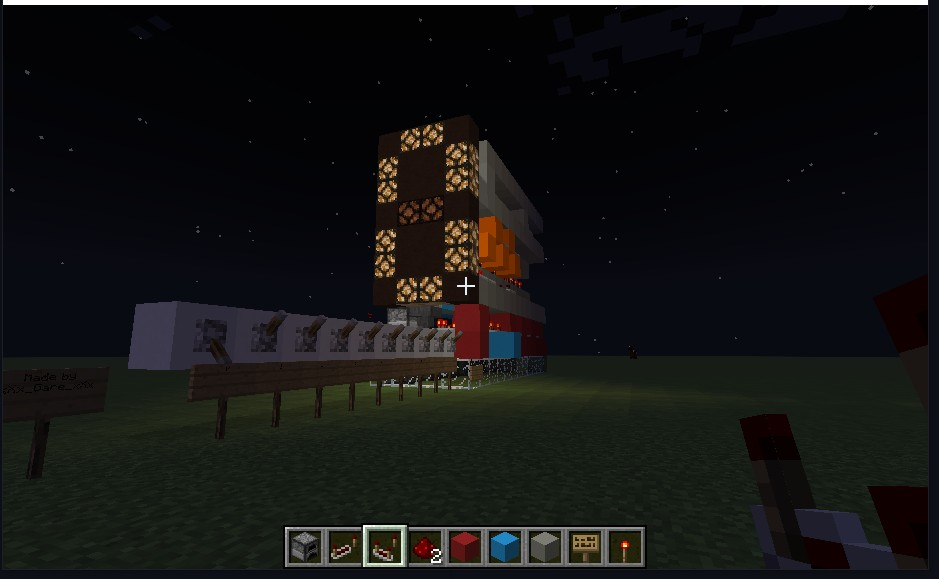
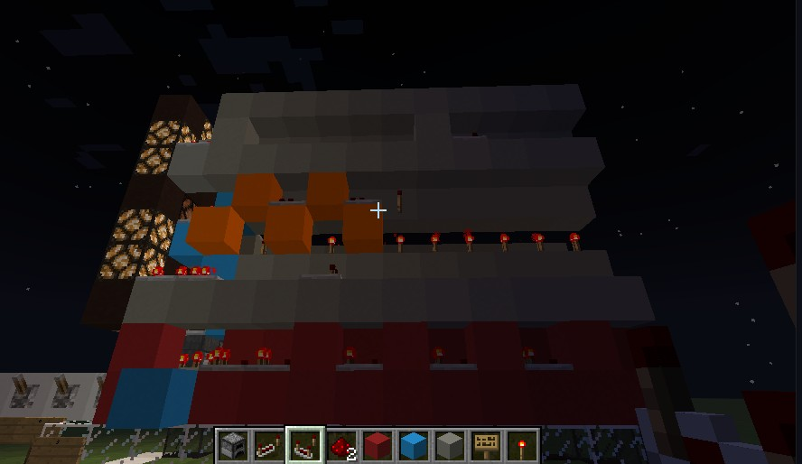
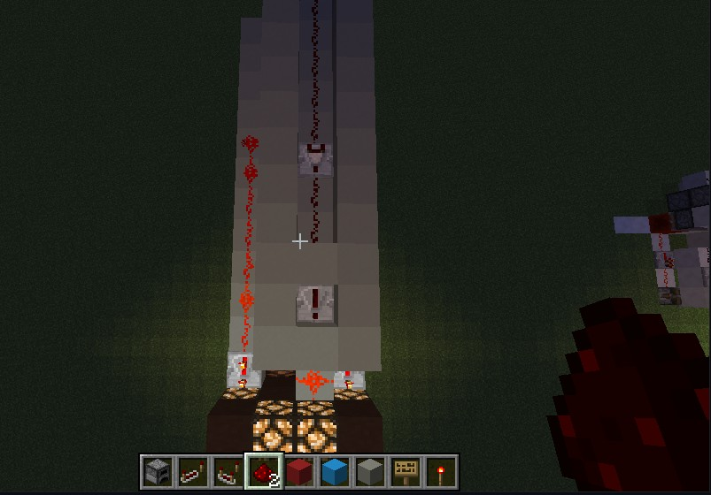

# Turing Machine 101 by xXx_Gare_xXx

## Preview

## How it works

The system receive some lever with some **signal strength**. Signal strength is how far the redstone power. If the signal strength of a redstone is 15 so it can travel up to 15 blocks. This system created using comparator, repeater, readstone torch, and also redstone lamp. Comparator used for controlling the signal strength to on and off the lamp
